### **This project has migrated to [Sunken Scrolls](https://scrolls.tessaract.gay/), a dedicated site for archiving Splatoon guides**

---

# Splatoon Guides

A curated list of resources for competitive Splatoon 3. Many community-made resources tend to only be available via word of mouth or social media posts, and this repository aims to compile them for anyone to easily access. Please create a new issue if you have any resources you think should be added!

Additionally, this repository is the home of [Running a Splatoon Team](Running%20a%20Splatoon%20Team.pdf), my guide for better organization of Splatoon teams!

## Contents
- [Guides](#guides)
- [Game Data](#game-data-and-mechanics)
- [Weapons](#weapons)
- [Specials and Subs](#specials-and-subs)
- [Sites](#sites)
- [Miscellaneous](#miscellaneous)

## Guides
- [**Running a Splatoon Team**](Running%20a%20Splatoon%20Team.pdf) - **my guide providing tools to improve scheduling and organization for captains and teams**
- [Competitive Splatoon Guidebook 1](https://www.splatoonstronghold.com/guides/competitive-splatoon-guidebook-part-1-competitive) - overview of competitive splatoon terminology and how to get into the scene
- [Competitive Splatoon Guidebook 2](https://www.splatoonstronghold.com/guides/competitive-splatoon-guidebook-part-2-tournaments) - overview of tournament terminology and common tournaments to enter
- [Competitive Splatoon Guidebook 3](https://www.splatoonstronghold.com/guides/competitive-splatoon-guidebook-part-3-contributing) - overview of getting into supportive roles in the community like tournament organizing and commentating.
- [Captains Guide Video Series](https://www.youtube.com/watch?v=Wtp-X-1W5rU&list=PLiBtcHtdkvJZk7OhLVf9o7qzIgXywZEID&pp=iAQB) - series going over forming and running a team
- [Comp Styles Guide](https://docs.google.com/document/d/1NLrgzGpfDxZCiOfUuLKgaBhQ7YAMjhnsRwWSCr1-kq0/edit?usp=sharing) - weapon compositions and their associated strategies/win conditions
- [Playing Smarter - Tactical Thinking](https://zy-f.notion.site/playing-smarter-a-guide-to-improving-tactical-thinking-625e307d08f142b6bb97895117365425) - a guide to improving beyond raw mechanical ability
- [Map Callouts](https://drive.google.com/drive/folders/1qJ2j1VtQnHWvJEqf0Qv0L0WiLHADV0Bv) - shorthand for different areas of (most) Splatoon stages
  
## Game Data and Mechanics
- [Clam Blitz Mechanics](https://youtu.be/QHQqN8ISFcw) - clam blitz guide + mechanics
    - 

Dropped clams when splatted
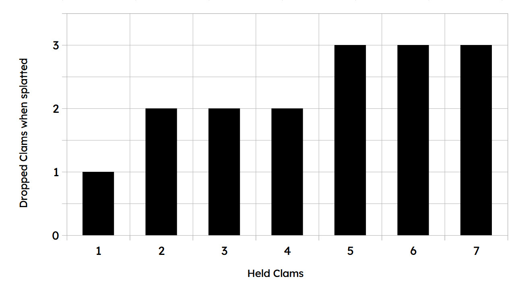

    - 

Points for special
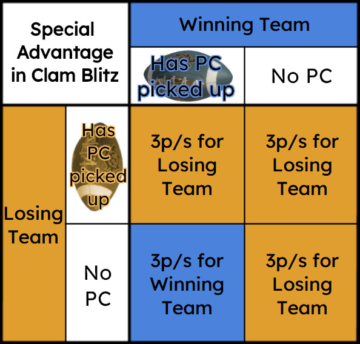

    - 

Symmetry of clam spawns
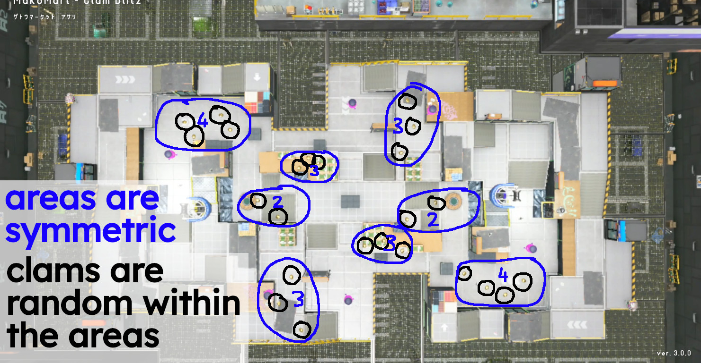

    - 

Common Clam Blitz Maps

        

Barnacle and Dime
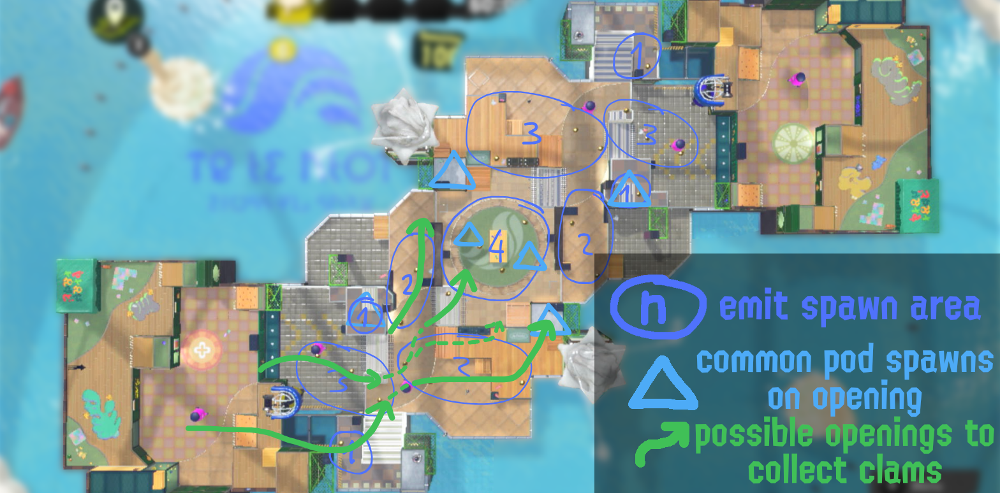

        

Crableg Capital
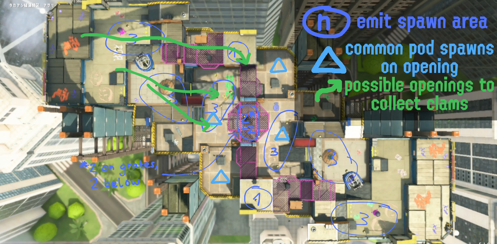

        

Inkblot Art Academy
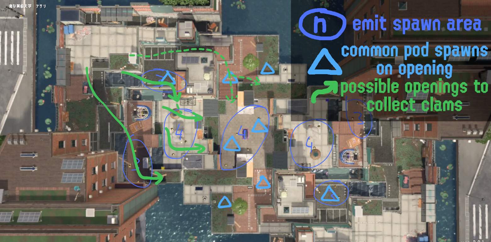

        

MakoMart
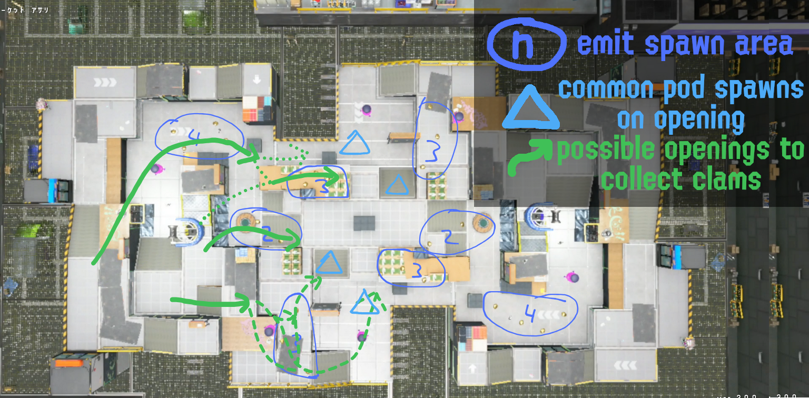

        

Museum d'Alfonsino
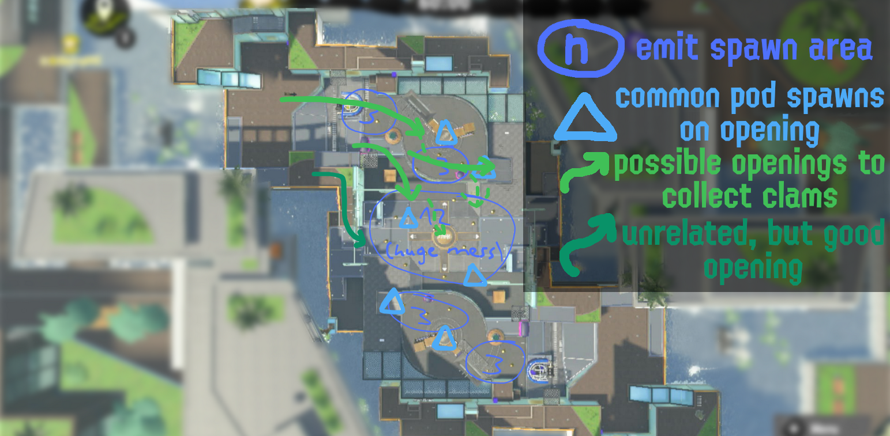

        

Scorch Gorge
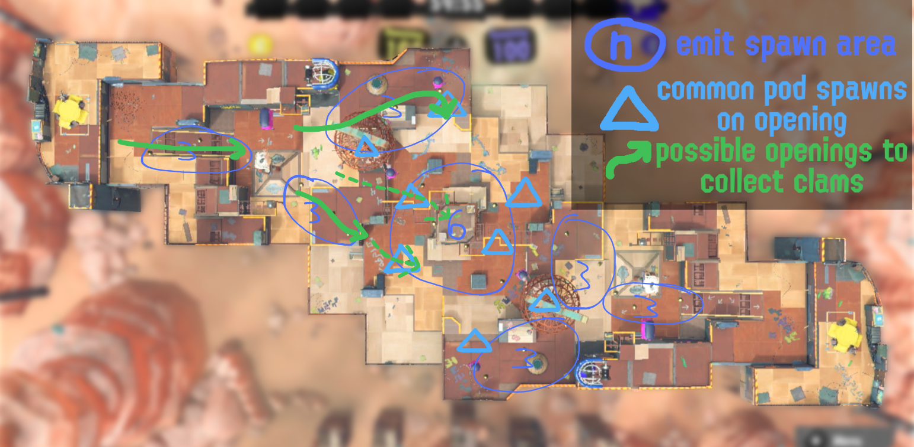

        

Um'ami Ruins
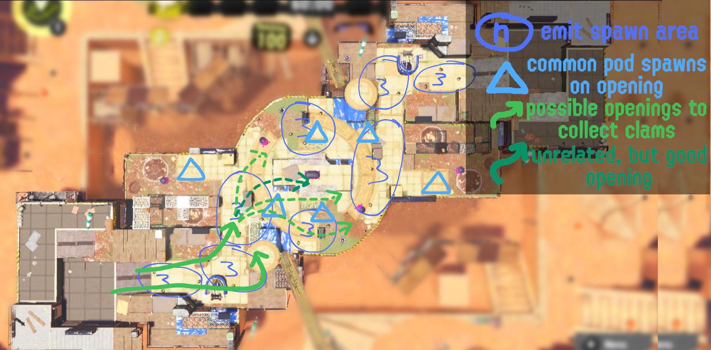

      

- [Passive Special Charge](https://www.youtube.com/watch?v=BSwgIHx2MrA) - mechanics for passive special charge by game mode
- [Shot Spread](infographics) - infographics detailing shot spread and deviation
  - 

Shooters

  - 

Dualies
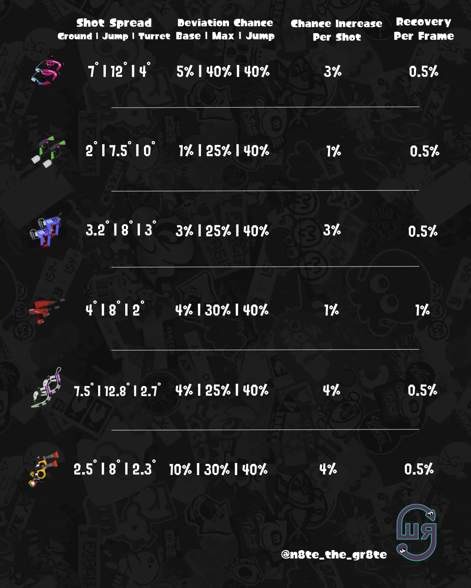

  - 

Splatlings
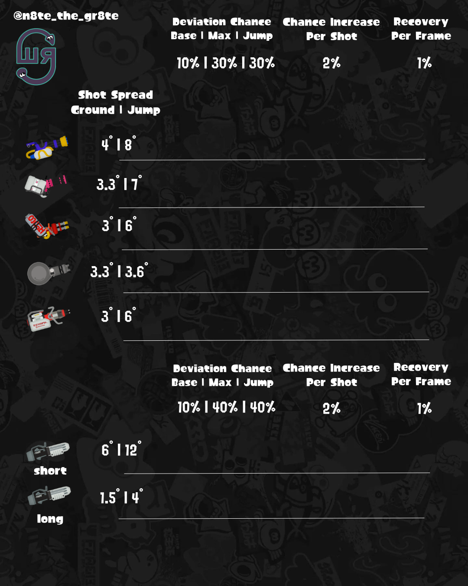

  - 

Blasters
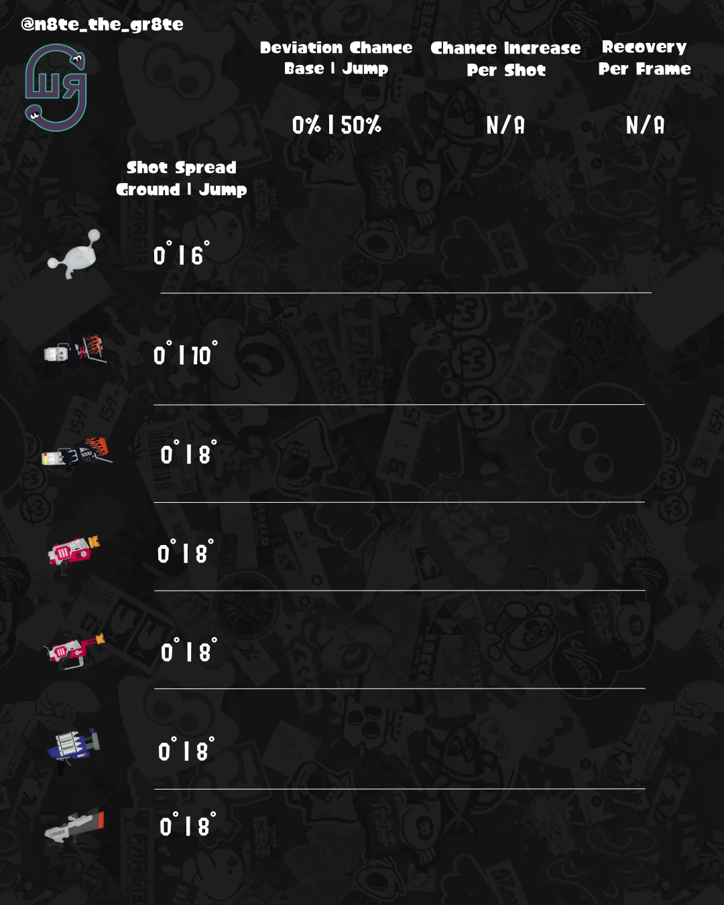

- [Brella Weapon Stats](https://docs.google.com/spreadsheets/d/1rcXWZJW8jTXNZrFRA3Tqi5UjsfvcbGiZ5e1Zy9_DJrs/htmlview#) - ink efficiency, shield multipliers, etc.
- 

Stringer Stats
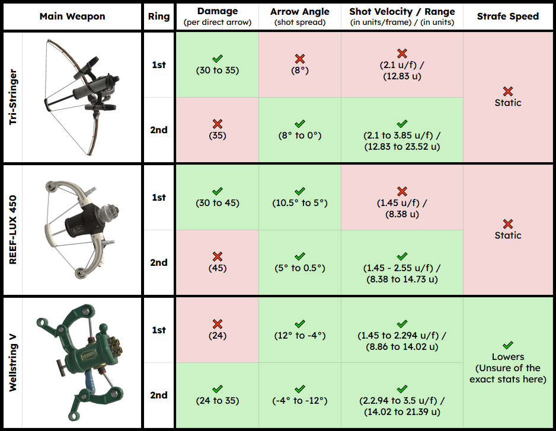Credit: <a href="https://bsky.app/profile/stripesafterdeath.bsky.social">@stripesafterdeath.bsky.social</a>

- [Ink Rail Mechanics (JP)](https://www.youtube.com/shorts/o0hN4b8Ki9E) - mechanics and movement using rails
- [Miscellaneous Mechanics](https://www.youtube.com/watch?v=s-8gkQX1BoQ) - variety of unexplained mechanics
- [Lean's Resources](https://leanny.github.io/) - databases for gear, weapons, cosmetics, etc.
    - [Gear Seed Checker](https://leanny.github.io/splat3seedchecker/#/) - deterministically obtain gear abilities
      
## Weapons
- [Snipewriter 5H](https://www.youtube.com/watch?v=tfxVtbsTcsM)
- [Slosher](https://www.youtube.com/watch?v=d3xnDiSKDoU)
- [Slosher Deco](https://www.youtube.com/watch?v=2sK5ActTRd8)
- [Tri-Slosher](https://www.youtube.com/watch?v=hPD1p-rD3Z4p)
- [Tri-Slosher Nouveau](https://www.youtube.com/watch?v=s0bAuwkrVbw)
- [Sloshing Machine](https://www.youtube.com/watch?v=IApkMf_3d64)
- [Carbon Deco](https://www.youtube.com/watch?v=g3kLIta6BIE)
- [Inkbrush](https://www.youtube.com/watch?v=dFedebEHDNw)
- [Painbrush Roll Tech](https://www.youtube.com/watch?v=00l6DHZfbpY)
- [Splat Dualies (Part 1)](https://www.youtube.com/watch?v=D7NCkjEQcKU)
- [Splat Dualies (Part 2)](https://www.youtube.com/watch?v=421tbehJ9qo)
- [Dualie Squelchers](https://www.youtube.com/watch?v=5VKbP0aYmek)
- [Splat Brella](https://www.youtube.com/watch?v=Hcbkni-yyoU)
- [Tri-Stringer](https://www.youtube.com/watch?v=87dWL6a0tzQ)
- [Wellstring](https://docs.google.com/document/d/1s-afyV7nEUYi-t8Z8Kx0AKc8xViSRFvAAltZ6hF3WMQ/edit?tab=t.0)
- [Splatana Stamper](https://www.youtube.com/watch?v=9UEQ6hB0qQs)
- [Splatana Wiper](https://www.youtube.com/watch?v=SMQFLqwoUY8)
- [Splatoon VOD Resources](https://docs.google.com/spreadsheets/u/0/d/1ZoaHAclQp0pPyoWtLphxCXJUaMig41t_1jkAnart_1Y/htmlview#) - collection of streamers and youtubers sorted by weapon
  
## Specials and Subs
- [Crab Tank (Shadowind)](https://www.youtube.com/watch?v=JZmLdlfSu7I)
- [Crab Tank (Punchy)](https://docs.google.com/document/u/0/d/1BMljr_34RMUPn_8Kby-dlZiaaDR7KOPzBnuzmFGnEaI)
- [Kraken](https://www.youtube.com/watch?v=oackZvWEV1g)
- [Ink Vac](https://www.youtube.com/watch?v=l118uYt8M2Q)
- [Reefslider](https://www.youtube.com/watch?v=nOdMmLpYne0)
- [Wavebreaker Spots](https://www.youtube.com/watch?v=MtAjldIGFG4)
- [Toxic Mist](https://www.youtube.com/watch?v=XgmN60UJ5w4)
- [Angle Shooter](https://www.youtube.com/watch?v=LUH71yqt9_U)
- [Squid Beakon](https://www.youtube.com/watch?v=aiZINOz3VEc)
- [Point Sensor](https://www.youtube.com/watch?v=73OfRfjRCw4)
- [Ink Mine](https://www.youtube.com/watch?v=6MAglxFummU)
- [Sprinkler](https://www.youtube.com/watch?v=y-3mQHENezA)
    - [Sprinkler Spots](https://www.youtube.com/watch?v=Ib4M4W5OY7g)
- [Splash Wall (Pika)](https://www.youtube.com/watch?v=0SEIu2pNAhk)
- [Splash Wall (Dude)](https://www.youtube.com/watch?v=5DUVYiGc2ek)
  
## Sites
- [sendou.ink](https://sendou.ink) - Community hub for tournaments, SendouqQ ranked matches, gear builds, etc.
- [stat.ink](https://stat.ink) - Track match data and statistics
    - [s3s](https://github.com/frozenpandaman/s3s) - Automate uploading to stat.ink (BROKEN)
    - [s3s + Docker](https://github.com/aaaldo/s3s_dockerized) - container for running s3s (BROKEN)
- [splat.top](https://splat.top/) - view top 500 players and weapon usage analytics (BROKEN)
- [JelonzoBot](https://splatoon.oatmealdome.me/) - Rotations for Splatoon 1 (Pretendo), 2, and 3
- [splatoon3.ink](https://splatoon3.ink/) - Splatoon 3 rotations and SplatNet gear
- [Inkipedia](https://splatoonwiki.org) - wiki for the Splatoon series
  
## Miscellaneous
- [Sendou.ink Scoreboard Tutorial](https://www.youtube.com/watch?v=AFCgT_Is7k8) - pull tournament match information via Sheets.io
- [Splat Weapon Tracker](https://epicyoshimaster.neocities.org/projects/splat-weapon-tracker) - display weapon stats on a dashboard
- [Weapon Kit Generator](https://yagaa.itch.io/yagas-weapon-kit-generator) - generate custom weapon kits
- [Splashtag Maker](https://splashtagmaker.com/) - generate a custom splashtag
